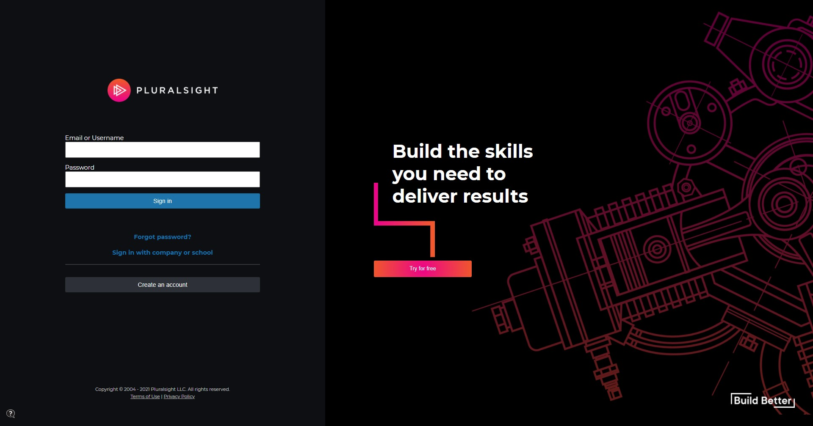

# Pluralsight login clone

This project is a clone of the pluralsight login page. It will test your ability to use HTML and CSS to build responsive websites.

### Design

### Demo

Have a look at the [demo](https://gracious-swirles-2a723c.netlify.app/). It is a work in progress and if you have any suggestions on how I can improve it please let me know.
